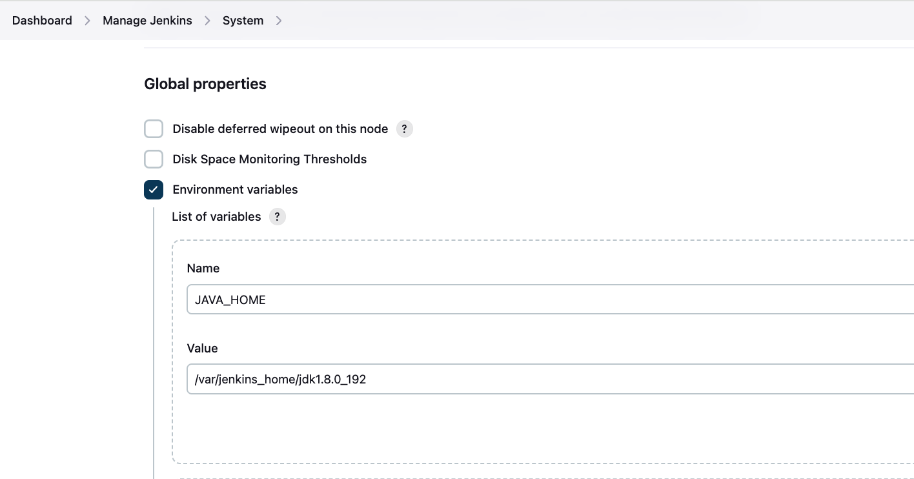
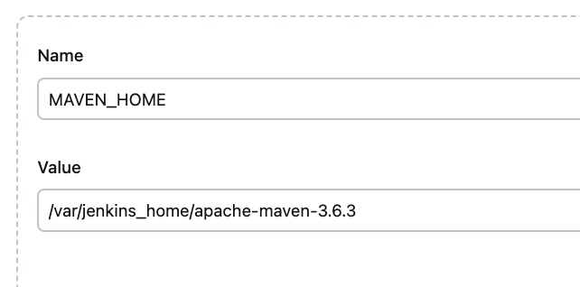

# Jenkins 安装

### Docker 方式安装 Jenkins

```bash
docker pull jenkins/jenkins:2.440.2-lts

# 修改宿主机所需数据持久化目录的属主和属组为容器中jenkins用户对应的属主和属组
# 此处以 /docker_data/jenkins/jenkins_home 为宿主机 jenkins_home 映射目录
mkdir -p /docker_data/jenkins/jenkins_home
chown -R 1000:1000 /docker_data/jenkins/jenkins_home

docker run --name jenkins2.440.2 --restart always -d \
  -p 8080:8080 \
  -p 50000:50000 \
  -v /docker_data/jenkins/jenkins_home:/var/jenkins_home \
  jenkins/jenkins:2.440.2-lts

# 容器启动后访问宿主机ip:8080即可打开jenkins的web页面
# 推荐安装默认的插件，还需安装插件：maven、gitee、ssh、docker
```


### 安装 JDK

将 JDK 包解压到宿主机 /docker\_data/jenkins/jenkins\_home 下，启动时会自动挂载到 jenkins\_home 下，然后配置好环境变量即可（Dashboard -> Manage Jenkins -> System: Global properties - Environment variables）

```
# 此处演示案例为 jdk1.8.0_192
Name:
JAVA_HOME

Value:
/var/jenkins_home/jdk1.8.0_192
```

<figure><figcaption></figcaption></figure>

### 安装 Maven

将 Maven 包解压到宿主机 /docker\_data/jenkins/jenkins\_home 下，启动时会自动挂载到 jenkins\_home 下，然后配置好环境变量即可（Dashboard -> Manage Jenkins -> System: Global properties - Environment variables）

```
# 此处演示案例为 maven-3.6.3
Name:
MAVEN_HOME

Value:
/var/jenkins_home/apache-maven-3.6.3
```

<figure><figcaption></figcaption></figure>

#### 配置 maven 仓库（vim conf/settings.xml）

```xml
<?xml version="1.0" encoding="UTF-8"?>
<settings xmlns="http://maven.apache.org/SETTINGS/1.0.0"
          xmlns:xsi="http://www.w3.org/2001/XMLSchema-instance"
        xsi:schemaLocation="http://maven.apache.org/SETTINGS/1.0.0 http://maven.apache.org/xsd/settings-1.0.0.xsd">
        <localRepository>/var/jenkins_home/.m2/repository</localRepository>
    <mirrors>
        <mirror>
            <id>alimaven</id>
            <mirrorOf>central</mirrorOf>
            <name>aliyun maven</name>
            <url>http://maven.aliyun.com/nexus/content/repositories/central/</url>
        </mirror>
        <mirror>
            <id>mirror</id>
            <mirrorOf>central,jcenter,!rdc-releases,!rdc-snapshots</mirrorOf>
            <name>mirror</name>
            <url>https://maven.aliyun.com/nexus/content/groups/public</url>
        </mirror>
        <mirror>
            <id>nexus</id>
            <name>internal nexus repository</name>
            <url>http://git.xxxxxxxx.cn:8280/nexus/content/groups/public/</url>
            <mirrorOf>central</mirrorOf>
        </mirror>

    </mirrors>
    <servers>
        <server>
            <id>rdc-releases</id>
            <username>619c83ae50fce0bb4f1157b3</username>
            <password>U)ChU3uiYcTP</password>
        </server>
        <server>
            <id>rdc-snapshots</id>
            <username>619c83ae50fce0bb4f1157b3</username>
            <password>U)ChU3uiYcTP</password>
        </server>
        <server>
            <id>nexus</id>
            <username>nexus</username>
            <password>xxxxxxxx</password>
        </server>
    </servers>
    <profiles>
        <profile>
            <id>rdc</id>
            <properties>
                <altReleaseDeploymentRepository>
                    rdc-releases::default::https://packages.aliyun.com/maven/repository/2158702-release-GNKzR2/
                </altReleaseDeploymentRepository>
                <altSnapshotDeploymentRepository>
                    rdc-snapshots::default::https://packages.aliyun.com/maven/repository/2158702-snapshot-iW41eL/
                </altSnapshotDeploymentRepository>
            </properties>
            <repositories>
                <repository>
                    <id>central</id>
                    <url>https://maven.aliyun.com/nexus/content/groups/public</url>
                    <releases>
                        <enabled>true</enabled>
                    </releases>
                    <snapshots>
                        <enabled>false</enabled>
                    </snapshots>
                </repository>
                <repository>
                    <id>snapshots</id>
                    <url>https://maven.aliyun.com/nexus/content/groups/public</url>
                    <releases>
                        <enabled>false</enabled>
                    </releases>
                    <snapshots>
                        <enabled>true</enabled>
                    </snapshots>
                </repository>
                <repository>
                    <id>rdc-releases</id>
                    <url>https://packages.aliyun.com/maven/repository/2158702-release-GNKzR2/</url>
                    <releases>
                        <enabled>true</enabled>
                    </releases>
                    <snapshots>
                        <enabled>false</enabled>
                    </snapshots>
                </repository>
                <repository>
                    <id>rdc-snapshots</id>
                    <url>https://packages.aliyun.com/maven/repository/2158702-snapshot-iW41eL/</url>
                    <releases>
                        <enabled>false</enabled>
                    </releases>
                    <snapshots>
                        <enabled>true</enabled>
                    </snapshots>
                </repository>
            </repositories>
            <pluginRepositories>
                <pluginRepository>
                    <id>central</id>
                    <url>https://maven.aliyun.com/nexus/content/groups/public</url>
                    <releases>
                        <enabled>true</enabled>
                    </releases>
                    <snapshots>
                        <enabled>false</enabled>
                    </snapshots>
                </pluginRepository>
                <pluginRepository>
                    <id>snapshots</id>
                    <url>https://maven.aliyun.com/nexus/content/groups/public</url>
                    <releases>
                        <enabled>false</enabled>
                    </releases>
                    <snapshots>
                        <enabled>true</enabled>
                    </snapshots>
                </pluginRepository>
                <pluginRepository>
                    <id>rdc-releases</id>
                    <url>https://packages.aliyun.com/maven/repository/2158702-release-GNKzR2/</url>
                    <releases>
                        <enabled>true</enabled>
                    </releases>
                    <snapshots>
                        <enabled>false</enabled>
                    </snapshots>
                </pluginRepository>
                <pluginRepository>
                    <id>rdc-snapshots</id>
                    <url>https://packages.aliyun.com/maven/repository/2158702-snapshot-iW41eL/</url>
                    <releases>
                        <enabled>false</enabled>
                    </releases>
                    <snapshots>
                        <enabled>true</enabled>
                    </snapshots>
                </pluginRepository>
            </pluginRepositories>
        </profile>
    </profiles>
    <activeProfiles>
        <activeProfile>rdc</activeProfile>
    </activeProfiles>
</settings>
```
