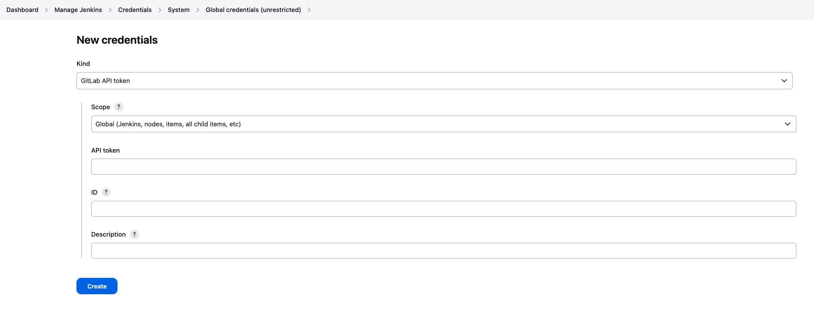
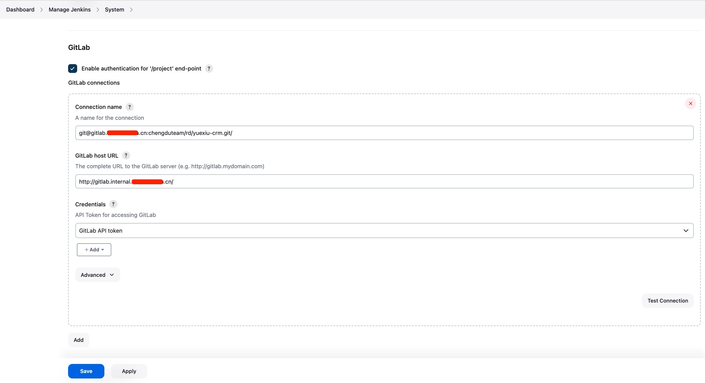

# 配置代码仓库

此处演示为配置GitLab代码仓库，凭证使用 API token 的方式

### 添加 GitLab API token 凭证

**Dashboard -> Manage Jenkins -> Credentials -> System -> Global crendentials -> Add Credentials**

<figure><figcaption></figcaption></figure>


### 配置 GitLab 仓库

**Dashboard -> Manage Jenkins -> System: GitLab（若无此项，检查GitLab相关插件是否安装）**

```
Connection name:
git@gitlab.xxxxxx.cn:chengduteam/rd/yuexiu-crm.git/

GitLab host URL:
http://gitlab.internal.xxxxxx.cn/
```

<figure><figcaption></figcaption></figure>
