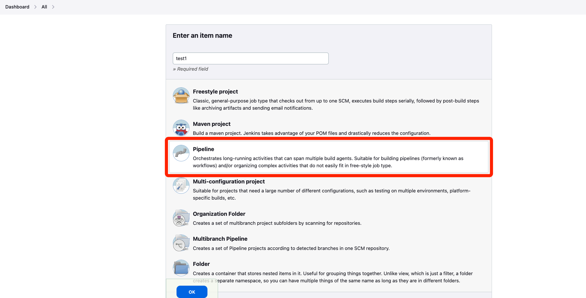
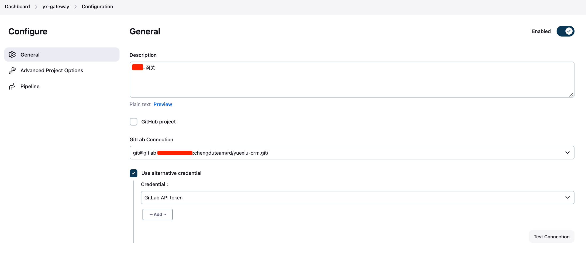
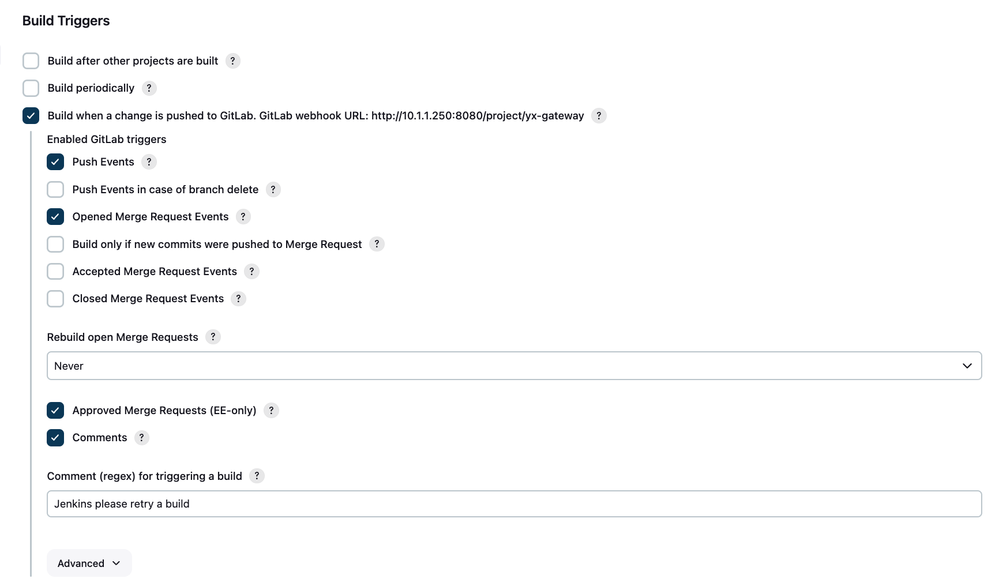
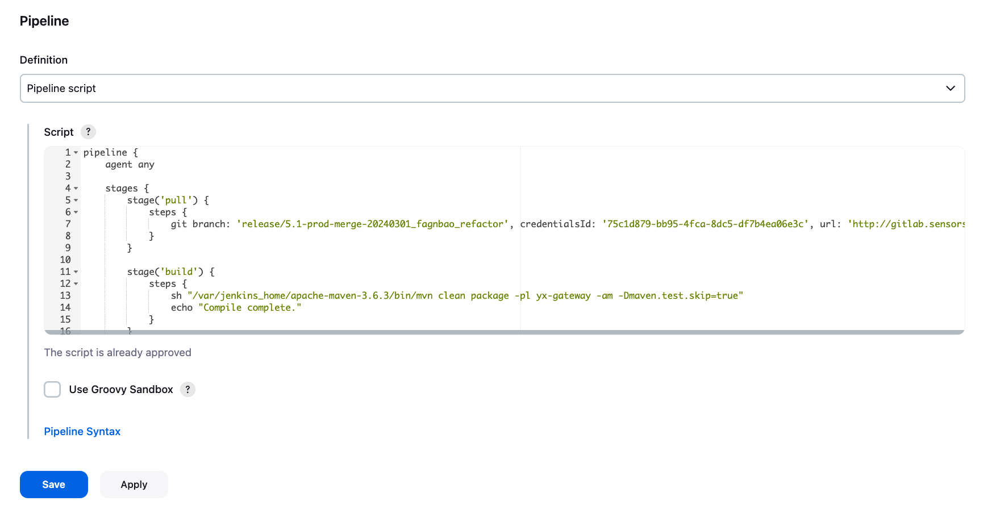
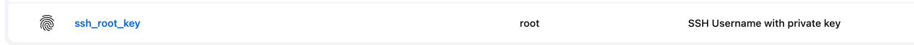

# 配置流水线

<figure><figcaption></figcaption></figure>


<figure><figcaption></figcaption></figure>


<figure><figcaption></figcaption></figure>


<figure><figcaption></figcaption></figure>

#### Pipeline script:

```
pipeline {
    agent any

    stages {
        stage('pull') {
            steps {
                git branch: 'release/5.1-prod-merge-20240301_fagnbao_refactor', credentialsId: '75c1d879-bb95-4fca-8dc5-df7b4ea06e3c', url: 'http://gitlab.xxxxxx.cn/chengduteam/rd/yuexiu-crm.git'
            }
        }
        
        stage('build') {
            steps {
                sh "/var/jenkins_home/apache-maven-3.6.3/bin/mvn clean package -pl yx-gateway -am -Dmaven.test.skip=true"
                echo "Compile complete."
            }
        }
        
        stage('deploy') {
            steps {
                sshagent(['ssh_root_key']) {
                    script {
                        sh 'ssh root@10.1.1.250 "bash /data/docker_data/jenkins/jenkins_home/DockerFiles/yx-gateway/deploy.sh"'
                    }
                }
            }
        }
    }
}

```

执行上方 Pipeline script 需先安装插件 SSH Agent，然后配置 Jenkins 的 SSH 密钥凭证，最后在脚本的 **sshagent** 项里添加上相关凭证

<figure><figcaption></figcaption></figure>

#### deploy.sh

```sh
#!/bin/bash
echo "拷贝jar包至Dockerfile同级目录"
cp /data/docker_data/jenkins/jenkins_home/workspace/yx-gateway/yx-gateway/target/yx-gateway-0.0.1-SNAPSHOT.jar /data/docker_data/jenkins/jenkins_home/DockerFiles/yx-gateway/

cd /data/docker_data/jenkins/jenkins_home/DockerFiles/yx-gateway/

DATETIME=$(date "+%F-%H-%M-%S")


LABEL_NAME="gateway"

echo "删除历史镜像开始==========================================="

# 定义时间间隔
TIME_INTERVAL="30 minutes"  # 时间间隔可以修改为 1 hour 或 1 day 或 2 hours 或 2 days

# 获取时间间隔之前的时间
TIME_AGO=$(date -d "$TIME_INTERVAL ago" "+%Y-%m-%dT%H:%M:%S")

echo "即将删除 $TIME_INTERVAL 前的无用镜像"
# 打印所有匹配标签的镜像 ID、名称和创建日期
echo "获取所有匹配标签的镜像信息为："
docker image ls --filter "label=com.example.service=$LABEL_NAME"

docker image ls --filter "label=com.example.service=$LABEL_NAME" --format '{{.ID}}' | while read IMAGE_ID; do
  CREATED_AT=$(docker inspect --format='{{.Created}}' "$IMAGE_ID")
  # 提取日期和时间部分，只保留年-月-日 时:分:秒
  CREATED_AT=$(echo "$CREATED_AT" | cut -d 'T' -f1,2)
  # 判断时间是否超过指定时间或镜像是否被容器使用
  if [[ ("$CREATED_AT" < "$TIME_AGO") && (-z "$(docker ps -q --filter ancestor="$IMAGE_ID")") ]]; then
    docker image rm "$IMAGE_ID"
    echo "删除镜像: $IMAGE_ID"
  else
    echo "保留镜像: $IMAGE_ID (被容器使用中或创建于 $TIME_INTERVAL 内)"
  fi
done

echo "删除镜像结束======================================================="

echo "docker build 构建镜像"
docker build -t yx-gateway:${DATETIME} --label=com.example.service=$LABEL_NAME .

echo "启动容器"
docker ps -a | grep yx-gateway
if [ "$?" -eq 0 ]; then
  docker rm -f yx-gateway
fi
docker run --name yx-gateway -itd -p 8331:8331 -v /data/docker_data/jenkins/jenkins_home/DockerFiles/yx-gateway/logs:/logs yx-gateway:${DATETIME}

echo "部署成功"
```
