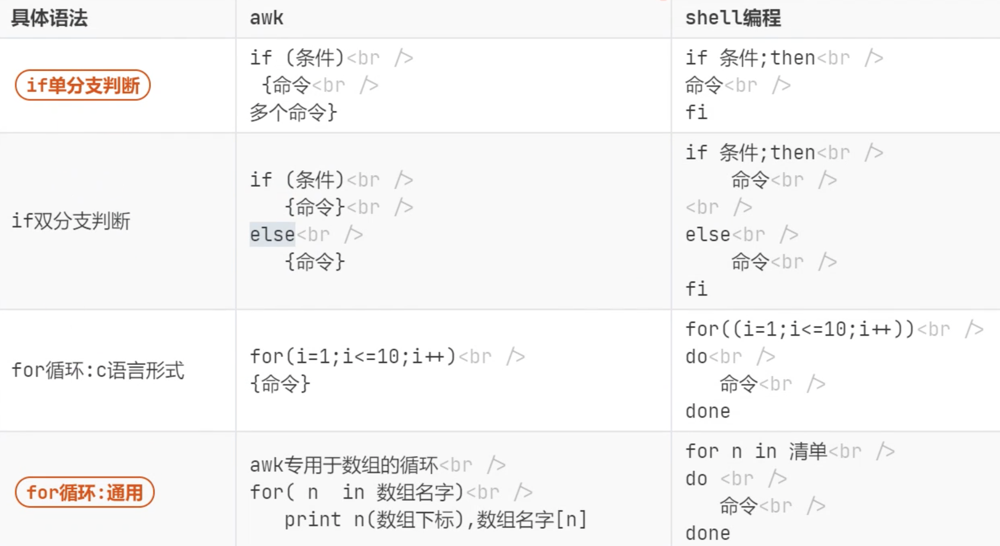

# AWK

### awk 常用选项与参数

| Option | Description |
| ------ | ----------- |
| -F     | 指定分隔符       |

### awk常用的内置变量

| Variable | Description                               |
| -------- | ----------------------------------------- |
| FILENAME | 当前输入文件名，若有多个文件，则只表示第一个。如果输入是来自标准输入，则为空字符串 |
| $0       | 当前记录的内容                                   |
| $N       | N表示字段号，最大值为NF变量的值                         |
| FS       | 字段分隔符，由正则表达式表示，默认为" "空格                   |
| RS       | 输入记录分隔符（换行符），默认为"\n"，即一行为一个记录             |
| NF       | 当前记录字段数                                   |
| NR       | 已经读入的记录数                                  |
| FNR      | 当前输入文件的记录数，请注意它与NR的区别                     |
| OFS      | 输出字段分隔符，默认为" "空格                          |
| ORS      | 输出记录分隔符，默认为"\n"                           |

#### 简单案例

```bash
awk -F ":" '{print NR,$1,$NF}' test.txt

# 打印test.txt文件内容中以:分隔后的第一列和最后一列并显示行号
```

```bash
awk 'NR==2,NR==3' test.txt

# 打印test.txt文件内容中第2行与第3行的内容
```

```bash
awk 'NR>1,NR<4' test.txt

# 打印test.txt文件内容中第2行与第3行的内容
```

```bash
awk 'NR==2{print $2}' test.txt

# 打印test.txt文件内容中第2行第2列的内容
```

```bash
# 查看本机正在使用的端口并排序显示

netstat -lntup | awk 'NR>2 {print $4}' | awk -F ":" '{print $NF}' | sort -n | uniq | nl
```


### 常用过滤

#### 过滤行

**过滤 /etc/passwd 中含有字符串 "nologin" 且行号大于 20 的行**

```bash
awk -F ':' '/nologin/ && NR>=20' /etc/passwd

# 输出
awk -F ':' '/nologin/ && NR>=20 {print $1,$NF}' /etc/passwd | column -t

nscd       /sbin/nologin
tcpdump    /sbin/nologin
rpc        /sbin/nologin
rpcuser    /sbin/nologin
nfsnobody  /sbin/nologin
nginx      /sbin/nologin
```

#### 过滤列

**过滤 /etc/passwd 中第三列小于10的行**

```bash
awk -F ':' '$3<10' /etc/passwd

# 输出
awk -F ':' '$3<10' /etc/passwd

root:x:0:0:root:/root:/bin/bash
bin:x:1:1:bin:/bin:/sbin/nologin
daemon:x:2:2:daemon:/sbin:/sbin/nologin
adm:x:3:4:adm:/var/adm:/sbin/nologin
lp:x:4:7:lp:/var/spool/lpd:/sbin/nologin
sync:x:5:0:sync:/sbin:/bin/sync
shutdown:x:6:0:shutdown:/sbin:/sbin/shutdown
halt:x:7:0:halt:/sbin:/sbin/halt
mail:x:8:12:mail:/var/spool/mail:/sbin/nologin
```

**过滤 /etc/passwd 中第四列以0或1开头和结尾的行**

```bash
awk -F ':' '$4 ~ /^[01]$/ {print $1,$4,$NF}' /etc/passwd | column -t

# 输出
awk -F ':' '$4 ~ /^[01]$/ {print $1,$4,$NF}' /etc/passwd | column -t

root      0  /bin/bash
bin       1  /sbin/nologin
sync      0  /bin/sync
shutdown  0  /sbin/shutdown
halt      0  /sbin/halt
operator  0  /sbin/nologin

 
awk -F ':' '$4 ~ /^[01]+$/ {print $1,$4,$NF}' /etc/passwd | column -t

root      0    /bin/bash
bin       1    /sbin/nologin
sync      0    /bin/sync
shutdown  0    /sbin/shutdown
halt      0    /sbin/halt
operator  0    /sbin/nologin
games     100  /sbin/nologin
```

#### 统计

**统计 /etc/passwd 行数**

```bash
awk '{i++} END {print i}' /etc/passwd
```

**求和**

```bash
seq 10 > num.txt
awk '{i+=$1} END {print i}' num.txt

# 输出
55
```


### AWK 和 SHELL 语法区别

<figure><figcaption></figcaption></figure>


### 演示文件（下方均使用此文件进行演示）

```sh
cat user.txt 
​
user1 70 72 74 76 78 70
​
user2 80 82 84 86 88 80
​
user3 90 92 94 96 98 90
​
user4 60 62 64 66 68 60
​
user5 80 82 84 86 88 80
```


### if 判断

**输出第二列大于80的行的第一列**

```sh
awk '{if($2>=80) print $1}' user.txt
​
# 输出
user2
user3
user5
```

```bash
awk '{if($2>=80) print $1,$2}' user.txt
​
# 输出
user2 80
user3 90
user5 80
```

**同时输出多个结果**

```bash
awk '{if($2>=80) {print $1;print $2}}' user.txt
​
# 输出
user2
80
user3
90
user5
80
```


### for 循环

**循环取列**

```bash
head -1 user.txt | awk '{for(c=2;c<=NF;c++) print $c}'
​
# 输出
70
72
74
76
78
70
```

**循环求和**

```bash
head -1 user.txt | awk '{for(c=2;c<=NF;c++) {sum+=$c; print sum}; print sum}'
​
# 输出
70
142
216
292
370
440
440
```

```bash
head -1 user.txt | awk '{for(c=2;c<=NF;c++) sum+=$c; print sum}'
​
# 输出
440
```

```bash
head -1 user.txt | awk '{for(c=2;c<=NF;c++) sum+=$c; print sum/6}'
head -1 user.txt | awk '{for(c=2;c<=NF;c++) sum+=$c; print sum/(NF-1)}'
​
# 输出
73.3333
```

**求每行数据的平均值**

```bash
# 错误的用法，sum在处理每行时没清零，导致一直累加
awk '{for(c=2;c<=NF;c++) sum+=$c; print sum/(NF-1)}' user.txt 
​
# 输出
73.3333
156.667
250
313.333
396.667
```

```bash
# 正确的用法
awk '{sum=0; for(c=2;c<=NF;c++) sum+=$c; print sum/(NF-1)}' user.txt 
​
# 输出
73.3333
83.3333
93.3333
63.3333
83.3333
```


### 数组

#### 求每行的平均值并输出

```bash
awk '{sum=0; for(column=2;column<=NF;column++) sum+=$column; average[$1]=sum/(NF-1)} END{for(user in average) print user,average[user]}' user.txt
​
# 输出
user1 73.3333
user2 83.3333
user3 93.3333
user4 63.3333
user5 83.3333
```

#### 求每行平均值的和

```bash
awk '{sum=0; for(column=2;column<=NF;column++) sum+=$column; average[$1]=sum/(NF-1)} END{for(user in average) sum2+=average[user]; print sum2}' user.txt
​
# 输出
396.667
```

#### 求每行平均值的平均值

```bash
awk '{sum=0; for(column=2;column<=NF;column++) sum+=$column; average[$1]=sum/(NF-1)} END{for(user in average) sum2+=average[user]; print sum2/NR}' user.txt
​
# 输出
79.3333
```


### 脚本形式

```bash
cat avg.awk 
{sum=0; for(column=2;column<=NF;column++) sum+=$column; average[$1]=sum/(NF-1)} END{for(user in average) sum2+=average[user]; print sum2/NR}
​
awk -f avg.awk user.txt 
79.3333
```

#### 命令行参数数组 ARGC ARGV

* **ARGC** 命令行参数个数
* **ARGV** 每个参数的内容

```bash
cat arg.awk 
BEGIN{
    for(x=0;x<ARGC;x++)
        print ARGV[x]
    print ARGC
}
​
awk -f arg.awk 11 22 33
awk
11
22
33
4
```

### &#x20;生产案例

#### 统计 nginx 日志中非 GET 和 POST 请求的个数

```bash
awk '!/GET|POST/ {i++} END{print i}' access.log
```

#### 统计 nginx 日志中 GET 和 POST 请求各个状态码出现的次数

```bash
awk '/GET|POST/ {array[$9]+=1} END{for(n in array) print n,array[n]}' access.log
```

#### 统计 nginx 日志中 GET 和 POST 请求各个状态码的流量

```bash
awk '/GET|POST/ {array[$9]+=$10} END{for(n in array) print n,array[n]}' access.log
```
