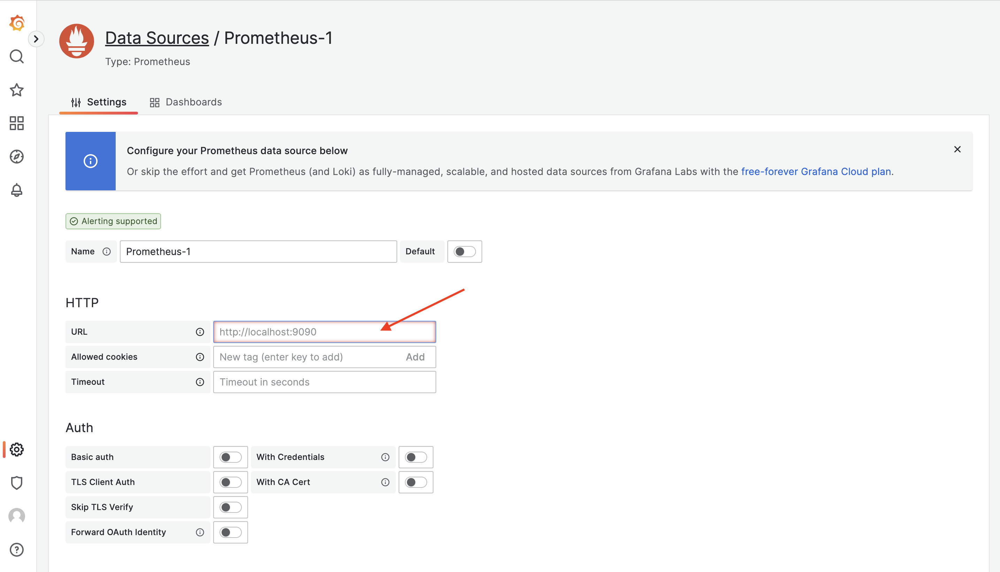

# 部署 Grafana

### 部署

#### Docker 方式部署

```bash
docker run -d --name=grafana \
  --net=host \
  -e TZ=Asia/Shanghai \
  --restart unless-stopped \
  grafana/grafana-enterprise
```

#### 二进制部署

```bash
# 获取程序文件
cd /tmp

wget https://dl.grafana.com/oss/release/grafana-9.4.7.linux-amd64.tar.gz

tar xf grafana-9.4.7.linux-amd64.tar.gz

mkdir -p /usr/local/grafana

cp -afr /tmp/grafana-9.4.7/* /usr/local/grafana/

# 启动程序
nohup /usr/local/grafana/bin/grafana-server web &>> grafana-server.log &

```


### 访问

```
http://192.168.31.19:3000/

# 用户名密码：admin/admin
```


### 安装 Zabbix 插件

```bash
docker exec -it grafana bash

grafana-cli plugins install alexanderzobnin-zabbix-app

exit

docker restart grafana
```


### 添加数据源 - Prometheus

在菜单位置：Configuration -> Data sources，点击 Add data source 就能进入数据源类型选择页面，选择 Prometheus，填写 Prometheus 的链接信息，主要是 URL，点击 Save & test 完成数据源配置。

<figure><figcaption></figcaption></figure>

<figure><figcaption></figcaption></figure>

Grafana 提供了和 Prometheus 看图页面类似的功能，叫做 Explore，我们可以在这个页面点选指标看图

<figure><figcaption></figcaption></figure>

但 Explore 功能不是最核心的，我们使用 Grafana，主要是使用 Dashboard 看图。Grafana 社区有很多人制作了各式各样的大盘，以 JSON 格式上传保存在了 [grafana.com](https://grafana.com/grafana/dashboards/)，我们想要某个 Dashboard，可以先去这个网站搜索一下，看看是否有人分享过，特别方便。因为我们已经部署了 Node-Exporter，那这里就可以直接导入 Node-Exporter 的大盘，大盘 ID 是 1860，写到图中对应的位置，点击 Load，然后选择数据源点击 Import 即可。

<figure><figcaption></figcaption></figure>

