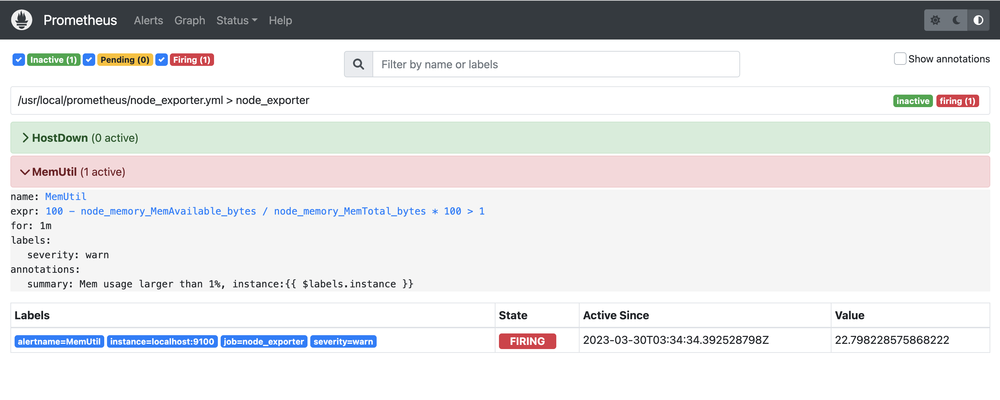

# Alertmanager

### 配置告警规则

我们可以把不同类型的告警规则拆分到不同的配置文件中，然后在 prometheus.yml 中引用。比如 Node-Exporter 相关的规则，我们命名为 node\_exporter.yml，最终这个 rule\_files 就变成了如下配置。

```yaml
# prometheus.yml
rule_files:
  - "node_exporter.yml"
```

```yaml
# node_exporter.yml
# 监控 Node-Exporter 挂掉以及内存使用率超过 1% 这两种情况
# 这里我故意设置了一个很小的阈值，确保能够触发告警

groups:
- name: node_exporter
  rules:
  - alert: HostDown
    expr: up{job="node_exporter"} == 0
    for: 1m
    labels:
      severity: critical
    annotations:
      summary: Host down {{ $labels.instance }}
  - alert: MemUtil
    expr: 100 - node_memory_MemAvailable_bytes / node_memory_MemTotal_bytes * 100 > 1
    for: 1m
    labels:
      severity: warn
    annotations:
      summary: Mem usage larger than 1%, instance:{{ $labels.instance }}
```

```bash
# 给 Prometheus 进程发个 HUP 信号，让它重新加载配置文件
kill -HUP `pidof prometheus`

```

```
# 可以去 Prometheus 的 Web 上（Alerts 菜单）查看告警规则的判定结果
http://127.0.0.1:9090/alerts
```

<figure><figcaption></figcaption></figure>

### 部署 Alertmanager

```bash
# 获取程序文件
cd /tmp

wget https://github.com/prometheus/alertmanager/releases/download/v0.25.0/alertmanager-0.25.0.linux-amd64.tar.gz

tar xf alertmanager-0.25.0.linux-amd64.tar.gz

mkdir -p /usr/local/alertmanager

cp -afr /tmp/alertmanager-0.25.0.linux-amd64/* /usr/local/alertmanager/

```

```bash
# 使用 systemd 托管，写入 service 文件
cat > /etc/systemd/system/alertmanager.service << EOF
[Unit]
Description="alertmanager"
After=network.target

[Service]
Type=simple

ExecStart=/usr/local/alertmanager/alertmanager
WorkingDirectory=/usr/local/alertmanager

Restart=on-failure
SuccessExitStatus=0
LimitNOFILE=65536
StandardOutput=syslog
StandardError=syslog
SyslogIdentifier=alertmanager


[Install]
WantedBy=multi-user.target
EOF

```

```yaml
# alertmanager.yml
# 配置alertmanager使用邮件告警
# 修过三处配置：
# 1、增加global（发件配置）
# 2、route里receiver修过为email
# 3、receivers里增加 - name: 'email'（收件配置）

global:
  smtp_from: 'anycing@sina.com'
  smtp_smarthost: 'smtp.sina.com:465'
  smtp_auth_username: 'anycing@sina.com'
  smtp_auth_password: 'a7c7b1c1e2c87571dz'
  smtp_require_tls: false
route:
  group_by: ['alertname']
  group_wait: 30s
  group_interval: 5m
  repeat_interval: 1h
  receiver: 'email'
receivers:
  - name: 'web.hook'
    webhook_configs:
      - url: 'http://127.0.0.1:5001/'
  - name: 'email'
    email_configs:
      - to: 'anycing@qq.com'
inhibit_rules:
  - source_match:
      severity: 'critical'
    target_match:
      severity: 'warning'
    equal: ['alertname', 'dev', 'instance']
```

```bash
# 启动服务
systemctl enable alertmanager
systemctl start alertmanager
systemctl status alertmanager

```

