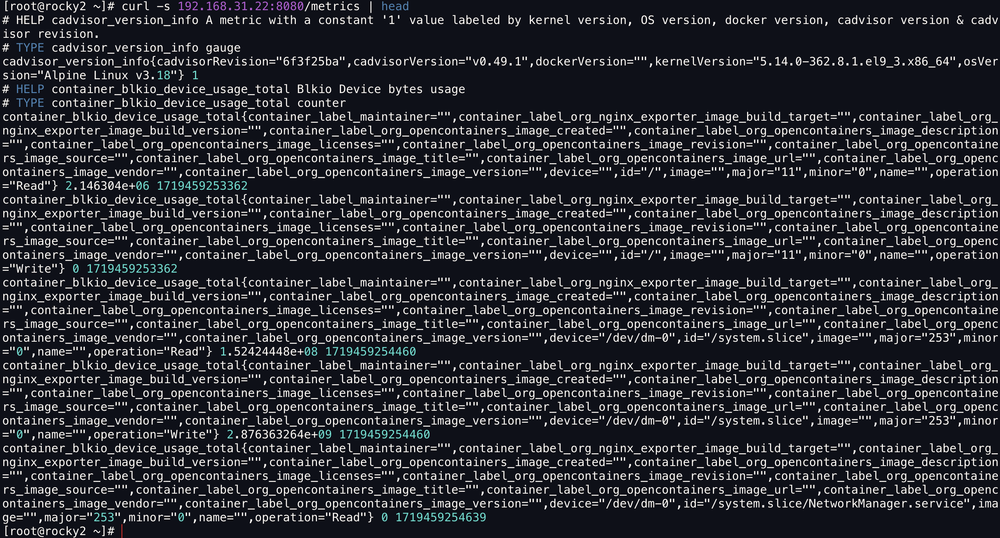

# cAdvisor

cAdvisor（Container Advisor）为容器用户提供对其运行容器的资源使用情况和性能特征的了解。

> **主页：**
>
> [https://github.com/google/cadvisor](https://github.com/google/cadvisor)


### Docker 方式部署

```bash
docker pull gcr.io/cadvisor/cadvisor:latest

docker run \
  --volume=/:/rootfs:ro \
  --volume=/var/run:/var/run:ro \
  --volume=/sys:/sys:ro \
  --volume=/var/lib/docker/:/var/lib/docker:ro \
  --volume=/dev/disk/:/dev/disk:ro \
  --publish=8080:8080 \
  --detach=true \
  --name=cadvisor \
  --privileged \
  --device=/dev/kmsg \
  gcr.io/cadvisor/cadvisor:latest
```

#### 命令行访问

```bash
curl -s 192.168.31.22:8080/metrics | head
```

<figure><figcaption></figcaption></figure>

#### 浏览器访问

```
192.168.31.22:8080
```

<figure><figcaption></figcaption></figure>

#### 修改 Prometheus 配置文件

```yaml
# vim prometheus.yml

scrape_configs:
  - job_name: "cAdvisor"
    static_configs:
      - targets:
        - "192.168.31.22:8080"
```

#### 重载配置文件

```bash
kill -HUP `pidof prometheus`
```

#### 浏览器访问 Prometheus

<figure><figcaption></figcaption></figure>
