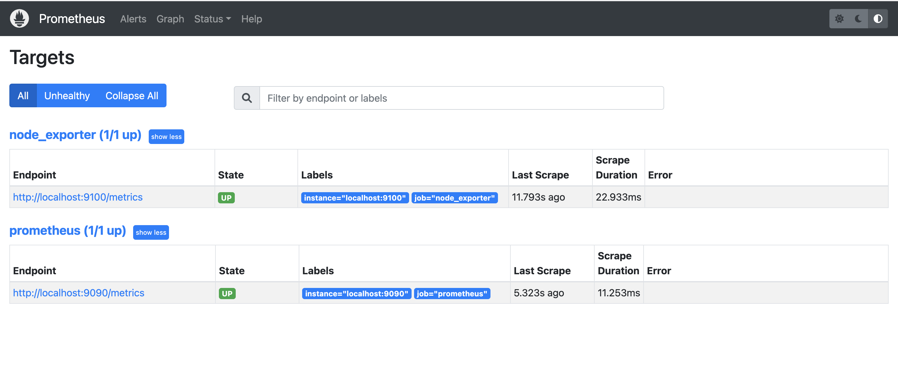

# Node Exporter

### 部署 Node exporter

```bash
# 获取程序文件
cd /tmp

wget https://github.com/prometheus/node_exporter/releases/download/v1.5.0/node_exporter-1.5.0.linux-amd64.tar.gz

tar xf node_exporter-1.5.0.linux-amd64.tar.gz

mkdir -p /usr/local/node_exporter

cp -afr /tmp/node_exporter-1.5.0.linux-amd64/* /usr/local/node_exporter/

cd /usr/local/node_exporter/

# 启动
nohup ./node_exporter &> output.log &

```


### 访问 node\_exporter

```bash
curl -s localhost:9100/metrics

```


### 修改 prometheus 的配置文件

#### 方式一 静态配置（每次添加完实例需要重载 Prometheus）：

```yaml
# vim prometheus.yml
# 路径：/usr/local/prometheus/prometheus.yml

# 在 scrape_configs 下新增 job_name
scrape_configs:
  - job_name: 'node_exporter'
    static_configs:
    - targets: ['localhost:9100']
```

```bash
# 让 Prometheus 重新读取配置
kill -HUP `pidof prometheus`
```

#### 方式二 动态配置（此方式只需在下方 Json 文件中添加实例即可被 Prometheus 发现，不用每次重载 Prometheus）：

```yaml
# /usr/local/prometheus/prometheus.yml
scrape_configs:
  - job_name: "linux_basic_info_auto_discovery_node_exporter"
    file_sd_configs:
    - files:
      - /usr/local/prometheus/linux_basic_info_auto_discovery_node_exporter.json
```

```json
# /usr/local/prometheus/linux_basic_info_auto_discovery_node_exporter.json
[{
  "targets": [
    "192.168.31.21:9100",
    "192.168.31.22:9100"
  ]
}]
```


### 访问 Prometheus

```
# 浏览器访问：在 Prometheus 的 Web 上（菜单位置 Status -> Targets）
http://172.20.10.11:9090/targets
```

<figure><figcaption></figcaption></figure>
