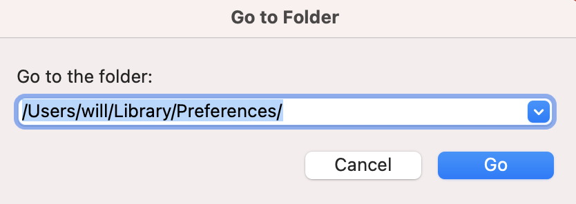
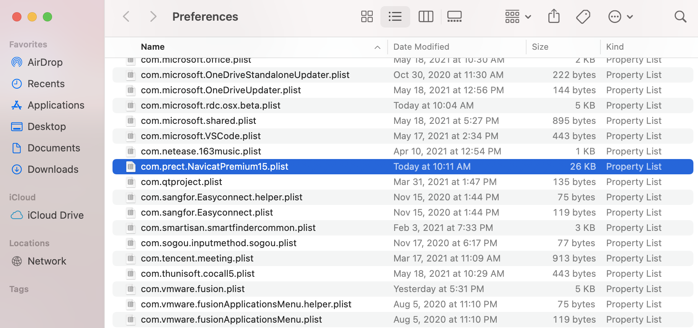
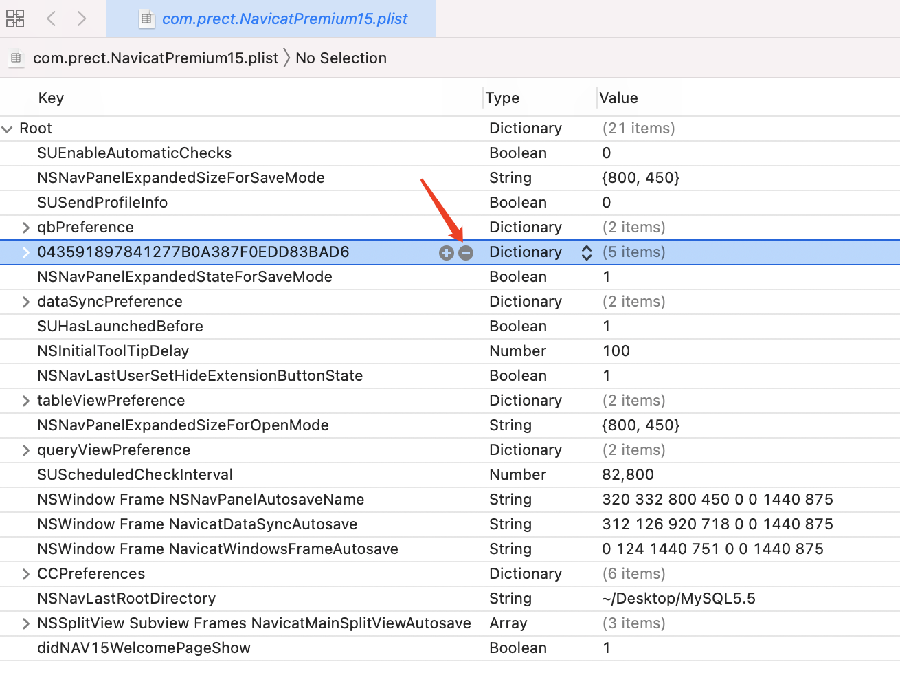

# Mac Navicat15 试用

### 1. 删除配置文件

#### 1.前往文件夹 /Users/will/Library/Preferences/

> 此处用户文件夹需替换为当前用户的文件夹，确定用户文件夹可使用命令行终端 `echo $HOME`，此处我的终端输出结果为 /Users/will ，使用输出结果加上 /Library/Preferences/ ，于是拼接成 /Users/will/Library/Preferences/



#### 2.找到文件 com.prect.NavicatPremium15.plist



#### 3.使用xcode打开文件并删掉指定字符串（数字和字母组成的随机字符串）后 Ctrl + s 保存



### 2. 删除配置文件

```bash
find ~/Library/Application\ Support/PremiumSoft\ CyberTech/Navicat\ CC/Navicat\ Premium/ -type f -name ".*" -exec rm -f {} \;
```

###

### 温馨提示


此方法目前验证Navicat15通过，其它版本未做测试


> **Navicat15 Mac版官方下载地址存档**
>
> [https://download3.navicat.com/download/navicat150\_premium\_en.dmg](https://download3.navicat.com/download/navicat150\_premium\_en.dmg)
