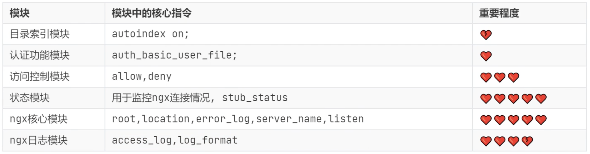

# 常用模块

<figure><figcaption></figcaption></figure>

### 参考文档

<table><thead><tr><th width="172">模块</th><th>文档</th></tr></thead><tbody><tr><td>核心</td><td><a href="https://nginx.org/en/docs/http/ngx_http_core_module.html">https://nginx.org/en/docs/http/ngx_http_core_module.html</a></td></tr><tr><td>日志</td><td><a href="https://nginx.org/en/docs/http/ngx_http_log_module.html">https://nginx.org/en/docs/http/ngx_http_log_module.html</a></td></tr><tr><td>访问控制</td><td><a href="https://nginx.org/en/docs/http/ngx_http_access_module.html">https://nginx.org/en/docs/http/ngx_http_access_module.html</a></td></tr><tr><td>目录索引</td><td><a href="https://nginx.org/en/docs/http/ngx_http_autoindex_module.html">https://nginx.org/en/docs/http/ngx_http_autoindex_module.html</a></td></tr><tr><td>认证功能</td><td><a href="https://nginx.org/en/docs/http/ngx_http_auth_basic_module.html">https://nginx.org/en/docs/http/ngx_http_auth_basic_module.html</a></td></tr><tr><td>状态</td><td><a href="https://nginx.org/en/docs/http/ngx_http_stub_status_module.html">https://nginx.org/en/docs/http/ngx_http_stub_status_module.html</a></td></tr></tbody></table>

